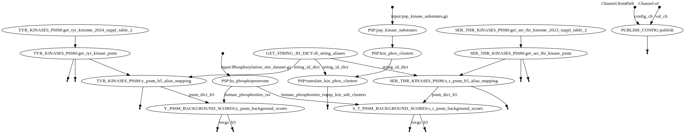

# Kinase PSSMs

Generate data required by the [PhosX](https://github.com/alussana/phosx) package

## Build the container image

Requires [Docker](https://www.docker.com) and [Apptainer](https://apptainer.org).

```bash
docker build -t kinase_pssms - < env/Dockerfile
docker save -o env/kinase_pssms.tar.gz ypssms
singularity build env/kinase_pssms.sif docker-archive://env/kinase_pssms.tar.gz
```

## Customise `nextflow.config`

Modify `process.executor`, `process.queue`, `workDir`, and `env.out_dir` according to the infrastructure where the workflow will be executed. Find the Nextflow [configuration file](https://www.nextflow.io/docs/latest/config.html) documentation.

Alternatively, as a minimal example to run the workflow locally, just replace the `nextflow.config` with `misc/nextflow-local.config` (a backup `nextflow.config~` will be created):

```bash
mv misc/nextflow-local.config nextflow.config -b
```

## Run the workflow

```bash
nextflow run main.nf -resume -c nextflow.config -with-dag misc/flowchart.svg
```

